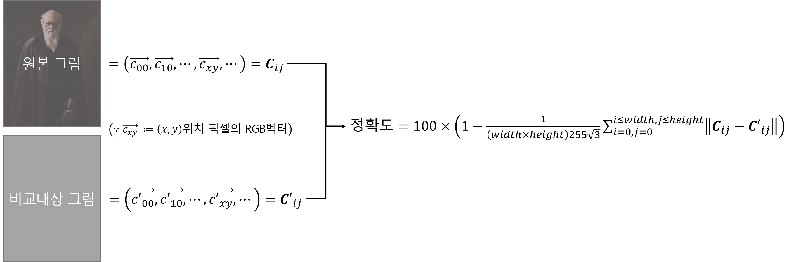

# Painting-with-GA
유전 알고리즘(GA - Genetic Algorithm)을 이용한 그림 그리기 구현

## 0. 그대로 실행 시 주의사항
그대로 실행 시, 하위 디렉토리 ```\datas``` 를 생성하고 학습 내용에 대해 모두 저장하도록 되어 있습니다.
수많은 파일을 생성하고 싶지 않다면, ```Program.cs``` 에서 ```Program```클래스의 ```Main()``` 함수를 수정하세요.

## 1. 유전 알고리즘 (Genetic Algorithm)
 자연의 진화과정에 기초한 계산 모델로써, 해를 유전자 형식으로 표현하고 적합도 함수(fitness function)를 통해 선택, 교배, 변이 등의 과정을 거치며 최적의 해(유전자)를 찾아가는 알고리즘
 
## 2. 적합도 함수(fitness function) 설정
 RGB값의 차이로 계산
 

